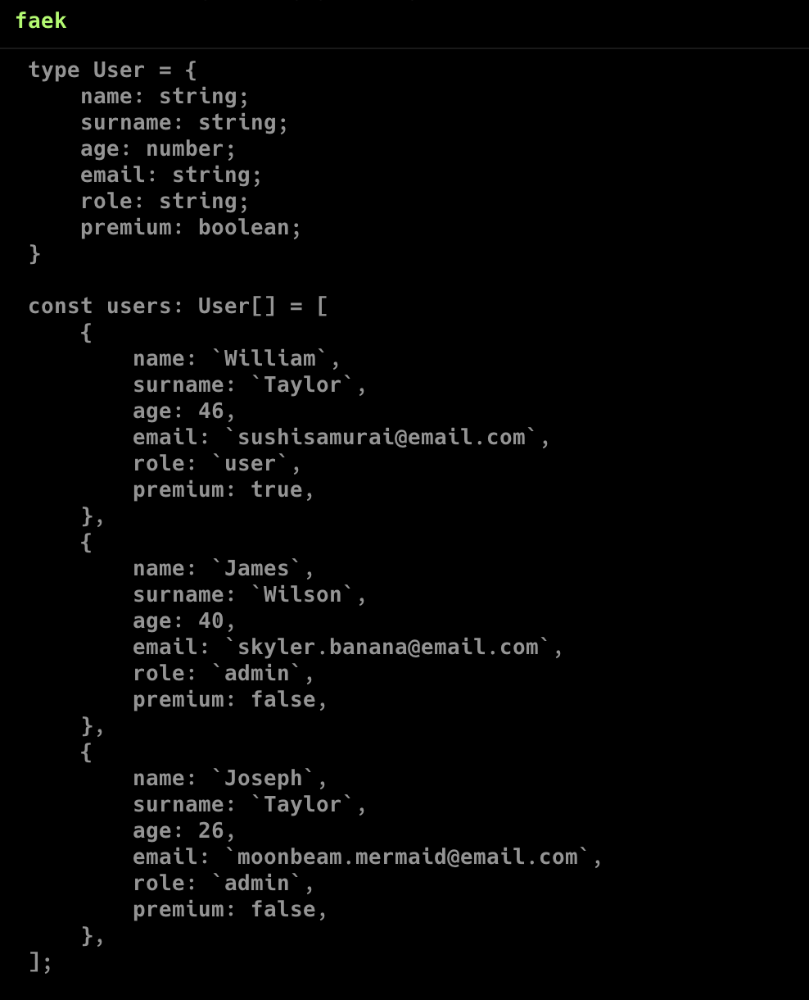

# Faek

### `Faek` is a lightweight TypeScript cli tool designed to effortlessly generate mock arrays with realistic and customizable data, perfect for testing and prototyping.



## Usage

```
$ faek [mode: -c | -h | -d [-template=<val>] [-len=<val>]]
       [language: -ts | -js | -json]
       [output: -file | -terminal]
```

## Available types

| Type    | Options            | Value                              |
| ------- | ------------------ | ---------------------------------- |
| string  | [length]           | lorem ipsum text with given length |
| number  | [max] or [min max] | random number within given range   |
| boolean |                    | true/false                         |
| date    |                    | date in given format               |
| img     |                    | img with given size                |
| strSet  | [str...]           | random word from given set         |

> _tip: While using strSet to define a custom set of strings for a field you can use underscores (\_). They will be replaced with spaces. e.g.: "super_admin" -> "super admin"_

## Predefined string fields

`Faek` automatically populates the following field names with random, realistic values from a predefined dataset when used in your schema:

- name
- surname
- email
- title
- content
- author

## Config mode

`Faek` will enter configuration mode on first startup, to enter configuration mode again, use `config` flag

```
$ faek -c
```

## Debug mode

`Faek` has a debug mode which can be used to quickly validate new functionality.

To use debug mode run faek with `debug` flag

```
$ faek -d
```

### Available templates

There are several templates to use in debug mode:

| Template | Description                                          |
| -------- | ---------------------------------------------------- |
| types    | contains all types, no custom type, no array name    |
| user     | simple user template with custom type and array name |
| imgs     | contains all variants for img field                  |
| dates    | contains all variants for date field                 |

to select template use `template` flag

```
$ faek -d -template=user
```

if no template is provided, types template is used by default

### Length

you can also specify the amount of array by using `length` flag

```
$ faek -d -length=10
```

if no length is provided, length is set to 5 by default

## Installation

1. Make sure you have [golang](https://go.dev/doc/install) installed
2. run `go mod download` to install dependencies
3. run app with `go run .`
4. build and install to path with `go build`, `go install`
