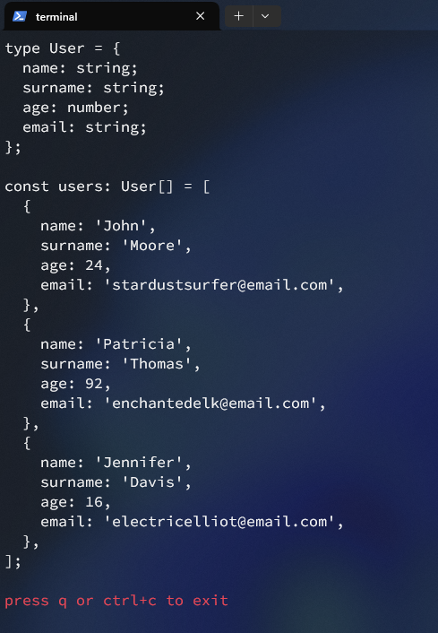

# Faek

### Faek is a simple typescript generation tool that generates mock arrays for you

## predefined fields

- name (string)
- surname, lastName, last_name (string)
- email (string)
- title (string)
- content (string)
- author (string)

## type conversion

Faek will convert some field types to ts equivalents

- int -> number
- float -> number
- short -> number
- str -> string
- char -> string
- bool -> boolean

## number range

You can specify the range of number generation for number fields

### syntax:

- `fieldName number` -> 0-100
- `filedName number x` -> 0-x
- `fieldName number x y` -> x-y
