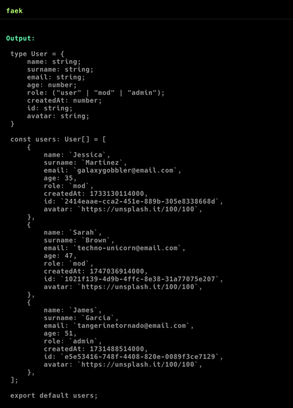

# Faek

### Faek is a simple typescript generation tool that generates mock arrays for you

## predefined fields

- name (string)
- surname, lastName, last_name (string)
- email (string)
- title (string)
- content (string)
- author (string)

## string set

There is a defined string set type, that will choose a random word provided by the user

### syntax

`> fieldName strSet option1 option_2 options...`

## date

There is a defined date type, with different variants

### variants:

- dateTime: e.g. `27.02.2024`
- timestamp: e.g. `1718051654`
- day: `0-31`
- month: `0-12`
- year: current year
- object: `new Date()`

### syntax:

`> fieldName date variant? dayDiff?`

## img type

There is a defined img type that inserts unsplash img

### sizes:

- default: `300x500`
- vertical: `500x300`
- profile: `100x100`
- article: `600x400`
- banner: `600x240`
- custom:

### syntax:

`> fieldName img size? x? y?`

#### example:

`> src img profile` -> {... src: "https://unsplash.it/100/100"}

`> src img 250 300` -> {... src: "https://unsplash.it/250/300}

## type conversion

Faek will convert some field types to ts equivalents

- int -> `number`
- float -> `number`
- short -> `number`
- str -> `string`
- char -> `string`
- bool -> `boolean`
- stringSet -> `strSet`
- ss -> `strSet`
- strs -> `strSet`
- strset -> `strSet`

## number range

You can specify the range of number generation for number fields

### syntax:

- `> fieldName number` -> 0-100
- `> filedName number x` -> 0-x
- `> fieldName number x y` -> x-y
